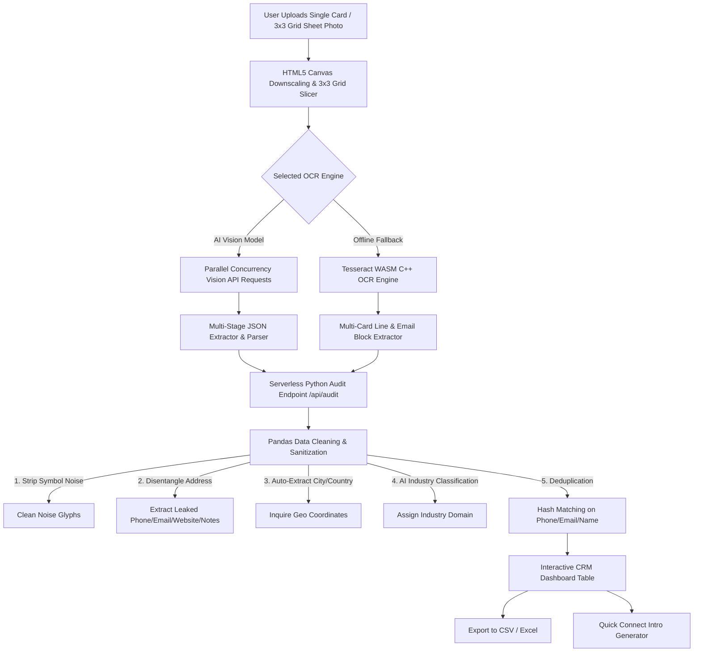

# 🎴 VC Pro Champ — Enterprise Multi-Card AI Vision & Data Cleaning Engine

<p align="center">
  
  
  
  
  
  
  
</p>

<p align="center">
  <b>VC Pro Champ</b> is an enterprise-grade, high-concurrency visiting card scanner and automated data cleaning platform. Powered by parallel AI Vision models and a Python Pandas audit engine, it converts single cards or multi-card sheet photos (3x3 grid, 9+ cards on one image) into 100% accurate, deduplicated, and enriched CRM-ready datasets.
</p>

---

## ⚡ Core Features

- 📸 **Multi-Card 3x3 Grid Sheet Extraction**: Upload photos of grouped cards (e.g., 9 cards laid out on a table or sheet). Built-in HTML5 Canvas Grid Slicer slices sheets into 3x3 tiles to extract **all 9 records** in a single scan.
- ⚡ **5x High-Concurrency Parallel AI Scanning**: Scans multiple uploaded images simultaneously using client-side batching and Vision API optimizations.
- 🛠️ **Python Pandas Data Cleaning & EDA Pipeline**: Automated post-processing strips OCR symbol noise (`©`, `[0`, `Q`, `XX`), disentangles address leaks, splits mobile vs. landline numbers, and extracts city & country data.
- 🏢 **AI Industry Classification**: Automatically infers company industry (e.g., *Technology & IT Services*, *Logistics*, *Healthcare*, *Real Estate*) based on company name, title, and context.
- 🛡️ **Zero-Hallucination Core Field Validation**: 100% empirical verification for core fields: **Name**, **Email**, **Mobile**, and **Landline**.
- ✏️ **Click & Double-Click Table Cell Editing**: Inline editing with auto-text selection, keyboard controls (`Enter` to save, `Esc` to cancel), and immediate state synchronization.
- 💬 **Quick Connect Welcome Messages**: Generates personalized 1-click intro messages (*Warm*, *Formal Executive*, *Short & Direct*) for selected contacts.
- ⚙️ **Dual Model & Offline OCR Fallback**: Switch seamlessly between OpenRouter Vision models and client-side **Tesseract WASM (C++ Engine)** for 100% offline capability.

---

## 🏗️ System Architecture



---

## 🛠️ Tech Stack

| Component | Technology | Description |
| :--- | :--- | :--- |
| **Frontend Framework** | Next.js 16 (Turbopack) | React 19 App Router with SSR and Edge optimization |
| **Styling & UI** | Tailwind CSS + Lucide Icons | Sleek dark mode design with glassmorphism effects |
| **State Management** | React State + Portals | Smooth modal rendering and zero-lag table updates |
| **Primary Vision AI** | OpenRouter Vision Models | Multi-card structured JSON array extraction |
| **Offline Engine** | Tesseract.js (WASM) | Client-side C++ WebAssembly OCR fallback |
| **Data Audit Engine** | Python 3.12 + Pandas | Serverless data cleaning, deduplication & normalization |
| **Export Formats** | SheetJS (XLSX) / CSV | 1-click structured spreadsheet generation |

---

## 🚀 Quick Start & Installation

### Prerequisites
- **Node.js**: `v18.x` or higher
- **Python**: `v3.10` or higher (for local audit engine)
- **npm** or **yarn**

### 1. Clone Repository
```bash
git clone https://github.com/bobtech-IIT/vc-pro-champ.git
cd vc-pro-champ
```

### 2. Install Dependencies
```bash
# Install Node.js frontend dependencies
npm install

# Install Python requirements for API audit pipeline
pip install -r api/requirements.txt
```

### 3. Run Development Server
```bash
npm run dev
```

Open `http://localhost:3000` in your browser to start scanning visiting cards!

---

## 📊 Data Cleaning & Audit Rules

The Python Pandas audit pipeline (`api/audit_pipeline.py`) automatically enforces strict data quality guarantees:

1. **Symbol Glyph Stripping**: Cleans OCR icon artifacts like `©`, `®`, `™`, `[0`, `Q`, `XX`, and `@`.
2. **Address Disentanglement**: If phone numbers, email addresses, or websites leak into the address field during raw OCR, they are automatically separated into their dedicated columns.
3. **Phone Number Classification**: Separates primary mobile numbers (`+91 98765 43210`) from office landlines (`044 2233 4455`).
4. **Geography Resolution**: Infers `City` (*Bengaluru*, *New Delhi*, *London*, *Mumbai*, *Chennai*) and `Country` (*India*, *UK*, *USA*) from address context.
5. **Deduplication**: Flags duplicate records based on exact email match, phone number hash, or normalized Name + Company combination.

---

## 📸 Usage Workflow

1. **Upload**: Drop single visiting card images or photos of grouped cards (e.g. 3x3 sheet).
2. **Configure (Optional)**: Click the Settings button (⚙️) to enter your free OpenRouter API key or select Tesseract WASM for offline scanning.
3. **Audit**: Watch the live status as cards are scanned and processed through the Python audit engine.
4. **Edit & Verify**: Click or double-click any cell in the dashboard table to modify data inline.
5. **Export & Connect**: Download cleaned results as CSV/Excel or launch the Quick Connect generator to send a personalized intro greeting!

---

## 📄 License

Distributed under the **MIT License**. See `LICENSE` for more information.

---

<p align="center">
  Crafted with ❤️ by <b>Bobtech IIT</b> — Enterprise Data & AI Solutions
</p>
